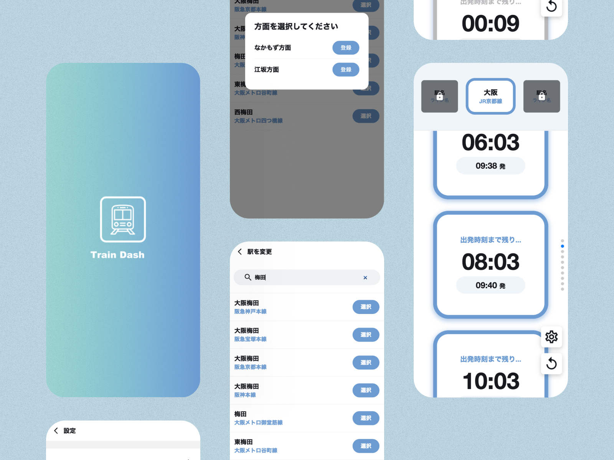

# ppputtyoのホームページ

## 経歴
2018~2022 大阪大学基礎工学部情報科学科
2022~現在 大阪大学大学院情報科学研究科

## 関わった製作物

## [英字論文フォーマッタ](http://to-normal-code.herokuapp.com/to-normal-code) ([GitHub](https://github.com/ppputtyo/ToNormalCode))

英字論文を DeepL で正しく翻訳されるようにフォーマットするツールです。
現在機能は以下の通り。
-   数学用英数字記号 → 普通の英数字 (例: 𝔸→A)
-   改行 → 半角スペース
-   改行で分割された単語の復元 (例:imple-[改行]ment→implement)
-   2 つ以上連続する改行は無視する
-   文末で改行する
-   5000文字を超えた場合に分割してDeepLで翻訳する
-   ワンクリックでフォーマットしたものを DeepL で翻訳

## [TrainDash](https://train-front.vercel.app/) ([GitHub](https://github.com/yuzuki-aritomo/train_front))

最寄りの駅の電車出発時刻をカウントダウン形式で表示するアプリ

## [LaboratoryGo](https://play.google.com/store/apps/details?id=ac.inoue.laboratorygo)
研究室にいるゼミ生の出席、離席、退席について確認することができるアプリ

研究室ごとにパスワードをかけることができ、研究室ログイン後にマイアカウントを作成することで出席、離席、退席の変更、メモ帳機能の利用ができる．

## アカウントURL

- [GitHub](https://github.com/ppputtyo)
- [AtCoder](https://atcoder.jp/users/ppputtyo)
- [Kaggle](https://www.kaggle.com/ppputtyo)

## 保有している資格

- 基本情報技術者

<!-- Algorithm: highest 1071

Heuristic: highest 1371 -->

